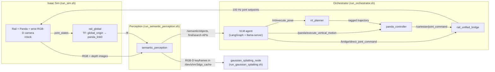
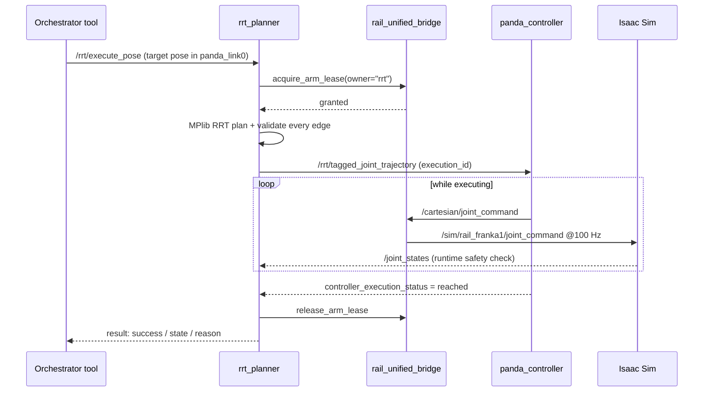
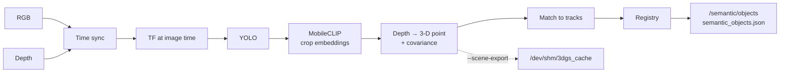

# 🏠 Home Robotics — Arena RealSim

[](https://docs.ros.org/en/humble/index.html)
[](https://developer.nvidia.com/isaac-sim)
[](https://www.python.org/)

> **About this repository.** This is a small part of the **Home Robotics** project, carried out in collaboration with **BEKO** at **METU ROMER**. This part was developed by the group **Becodeum**, made up of two summer interns, **Ali Görkem Küçük** and **Hakan Emre Kayacan**. See [Acknowledgements](#-acknowledgements).

Arena RealSim is a home-robotics stack built on NVIDIA Isaac Sim. A Franka Panda arm rides on a linear rail between two rows of desks. You give it a task in plain language, such as *"pick up the apple and place it into the purple bowl"*, and the system:

1. **perceives** the scene with a wrist RGB-D camera (YOLO + MobileCLIP), building a persistent 3-D **semantic map**
2. **plans** at a high level with a local vision-language model (VLM) that calls a small set of robot tools
3. **moves** the rail and arm safely using an RRT planner, a Cartesian controller and a bridge that decides who controls the arm
4. optionally **reconstructs** mapped objects or the whole scene as **3D Gaussian Splats**

---

## ⚡ Quick start

Every launcher sets `ROS_DOMAIN_ID=42`, `ROS_LOCALHOST_ONLY=1` and `RMW_IMPLEMENTATION=rmw_fastrtps_cpp`, so all nodes see each other on one machine. Run each command in its own terminal, in this order:

```bash
# 1. Simulator: Isaac Sim (rail scene) + the global_origin TF publisher
./run_sim.sh

# 2. Semantic perception: detection, 3-D localization, semantic map
./run_semantic_perception.sh
#    optional flags: --rviz | --rviz-confirmed-only | --publish-debug | --scene-export

# 3. (Optional) Gaussian Splatting trainer
./run_gaussian_splatting.sh

# 4. Orchestrator: bridge + RRT planner + Panda controller + VLM agent
./run_orchestrator.sh            # add --show-think to print the VLM's reasoning
```

Useful extras:

```bash
# Arena scene with articulated furniture and the TV streamer, plus an interactive CLI to control it
./scripts/start_arena.sh
python3 scripts/arena_controller.py

# View the wrist camera, or the YOLO debug overlay (activate agent_env first)
python3 scripts/view_wrist_camera.py --scale 0.6
python3 scripts/view_wrist_camera.py --topic /semantic/debug/yolo --scale 0.6

# Train a Gaussian Splat for one object, for whichever object has enough frames or the entire scene
ros2 service call /gaussian_splatting_node/optimize_object interface/srv/OptimizeObject "{object_id: 'object_023'}"
ros2 service call /gaussian_splatting_node/optimize_object interface/srv/OptimizeObject "{object_id: 'scene'}"
ros2 service call /gaussian_splatting_node/optimize_object interface/srv/OptimizeObject "{}"

# Watch the semantic map / planner status
ros2 topic echo /semantic/objects
ros2 topic echo /rrt/status
```

More tuned command lines (sim and real-camera variants) are in [`commands.txt`](commands.txt).

### Prerequisites

| Requirement | Where it is expected (override) |
|---|---|
| Isaac Sim 5.x | `~/isaacsim` or `~/isaac-sim` |
| ROS 2 Humble | `/opt/ros/humble` |
| `home_robotics` workspace (provides the `interface` msgs/srvs/actions, `panda_controller` and the Panda URDF/SRDF) | `~/workspace/home_robotics/homerobotics_ws` (`ARENA_HOME_ROBOTICS_SETUP`) |
| Python venv for the agent and perception | `agent_orchestrator/agent_env` |
| YOLO weights / MobileCLIP-S0 checkpoint | `agent_orchestrator/models/yolo26x.pt`, `mobileclip_s0.pt` (`ARENA_DETECTOR_MODEL`, `ARENA_MOBILECLIP_CHECKPOINT`) |
| llama.cpp `llama-server` + Qwen3-VL-8B GGUF + mmproj | `YOLO_VLM_LLAMA_ROOT`, `YOLO_VLM_MODEL_PATH`, `YOLO_VLM_MMPROJ_PATH` |
| Nerfstudio env (for splatting only) | `gaussian_splatting_ros/nerfstudio_env` |

Build the `interface` package in `home_robotics` first (`colcon build --packages-select interface`). Nothing downloads model weights at runtime: if a file is missing, the node stops with an error at startup.

> ⚠️ Some defaults are absolute paths from the development machine (`/home/thinkstation-sim/...` in `run_gaussian_splatting.sh` and `agent_orchestrator/src/config.py`). Override them with the environment variables above on a new machine.

---

## 🗺️ System overview



| Component | Entry point | Role |
|---|---|---|
| Simulator | `scripts/rail.py` (via `run_sim.sh`), `scripts/arena.py` | Loads a USD world, publishes `/clock`, cameras and joint states over the Isaac ROS 2 bridge |
| `rail_global` | `agent_orchestrator/src/rail_global.py` | Publishes the fixed world frame `global_origin` |
| `rail_unified_bridge_node` | `scripts/rail_bridge.py` | The only node that sends commands to Isaac; decides who controls the arm |
| `rrt_planner` | `agent_orchestrator/src/rrt_planner.py` | Collision-, limit- and singularity-checked joint trajectories |
| `panda_controller` | external (`home_robotics`) | Executes trajectories and vertical Cartesian moves |
| Orchestrator | `agent_orchestrator/src/main.py` | VLM task planner plus deterministic robot tools |
| `semantic_perception` | `semantic_perception/` | RGB-D detection → 3-D tracks → persistent semantic map |
| `gaussian_splatting_node` | `gaussian_splatting_ros/` | Trains 3DGS models from cached keyframes on request |

---

## 📡 How ROS message passing works here

The stack uses all three ROS 2 communication patterns. Each one is used for a specific kind of job:

| Pattern | Used for | Examples |
|---|---|---|
| **Topics** (streaming, fire-and-forget) | Sensor data, state, high-rate setpoints | camera images, `/joint_states`, `/tf`, `/cartesian/joint_command`, `/semantic/objects` |
| **Services** (request → immediate reply) | Short, atomic decisions | `/bridge/acquire_arm_lease`, `/semantic/search_objects`, `~/optimize_object` |
| **Actions** (goal → feedback → result, cancellable) | Anything that takes time and can fail | `/bridge/direct_joint_command`, `/rrt/execute_pose`, `/panda/execute_vertical_motion`, `/semantic/find_object` |

The design rule: **every motion is an action.** The caller gets a real success or failure (`reached`, `timeout`, `cancelled`, `safety_interrupted`, …) with a reason. It never has to guess from a topic whether a move finished.

### Networking and time

- **Isolation:** `ROS_DOMAIN_ID=42` plus `ROS_LOCALHOST_ONLY=1` keep the stack private to the machine. Every launcher must use the same values.
- **Simulation time:** `scripts/arena/sim_time.py` builds an OmniGraph that publishes Isaac's simulation time on `/clock`, and switches the camera helpers to stamp images with it. Perception and splatting therefore run with `use_sim_time:=true` by default (`ARENA_USE_SIM_TIME`), so image stamps and TF stamps come from the same clock.


### Frames (TF)

```
global_origin ──(rail_j1 along X, rotated 180° about Z)──► panda_link0 ──► … ──► eef / wrist_camera
```

`rail_global` reads `rail_j1` from `/sim/rail_franka1/joint_states` and publishes `global_origin → panda_link0`. **`rail_j1 = 0` is always the world origin**, whenever the nodes start. Before publishing, it watches `/tf` for 2 s. If `panda_link0` already has another parent, it refuses to start rather than create a broken TF tree. All semantic-map coordinates are expressed in `global_origin`.

### Main topic and interface map

| Name | Type | Producer → consumer |
|---|---|---|
| `/sim/rail_franka1/joint_states` | `JointState` | Isaac → bridge, `rail_global`, orchestrator |
| `/sim/rail_franka1/joint_command` | `JointState` | **bridge only** → Isaac (100 Hz) |
| `/joint_states`, `/sim/rail1/joint_states`, `/gripper_state` | `JointState` / `Float64` | bridge (arm, rail and gripper split out) → planner, controller, agent |
| `/sim/rail_franka1/cam/wrist/color/image_raw`, `…/depth/image_raw` | `Image` | Isaac → perception, orchestrator |
| `/bridge/direct_joint_command` | action `DirectJointCommand` | orchestrator → bridge (rail, gripper, arm posture) |
| `/bridge/acquire_arm_lease`, `/bridge/release_arm_lease`, `/bridge/emergency_arm_hold` | services | planner/controller → bridge |
| `/rrt/execute_pose` | action `ExecuteRrtPose` | orchestrator → RRT planner |
| `/rrt/tagged_joint_trajectory` | `TaggedJointTrajectory` | RRT planner → Panda controller |
| `/panda/controller_execution_status` | `ControllerExecutionStatus` | controller → RRT planner |
| `/panda/cancel_execution` | `String` (execution id) | RRT planner → controller |
| `/panda/execute_vertical_motion` | action `ExecuteVerticalMotion` | orchestrator → controller |
| `/cartesian/joint_command` | `JointState` | controller → bridge |
| `/rrt/hold_command` | `JointState` | RRT planner → bridge (safety stop) |
| `/rrt/status`, `/rrt/ready` | `String` (JSON), `Bool` | RRT planner → anyone |
| `/semantic/detections`, `/semantic/objects`, `/semantic/target_found` | `DetectedObjectArray` / `DetectedObject` | perception → orchestrator, RViz bridge |
| `/semantic/find_object` | action `FindObject` | orchestrator → perception |
| `/semantic/search_objects` | service `SearchSemanticObjects` | orchestrator → perception |
| `/semantic/association_diagnostics`, `/semantic/debug/yolo`, `/semantic/rviz/markers` | diagnostics / `Image` / `MarkerArray` | perception → tooling |
| `/gaussian_splatting_node/optimize_object` | service `OptimizeObject` | user → splatting node |

All custom types (`interface/msg|srv|action`) live in the `home_robotics` workspace.


---

## 🧩 Node design

- **Parameters for everything.** Nodes declare ROS parameters with safe defaults and validate them at startup. Launch scripts override them with `-p name:=value`. The orchestrator reads `YOLO_VLM_*` environment variables (`config.py`).
- **Fail closed.** Missing weights, unsafe poses, stale TF or wrong image sizes give an explicit error, never a silent guess.
- **Multi-threaded action servers.** A long action keeps running while feedback topics are still processed.
- **Run without building.** Launch scripts put the package on `PYTHONPATH` and start it with `python3 -m <pkg>.node`.

---

## 🦾 Motion control

Motion is split into layers, and **only the bridge ever sends commands to the simulator**.



| Module | What it does |
|---|---|
| **`rail_unified_bridge`**<br/>`scripts/rail_bridge.py` | Owns all commands to Isaac. Only one owner may control the arm at a time (an **arm lease**: `rrt`, `direct_vertical` or `direct_arm`). Serves `/bridge/direct_joint_command` for the rail, gripper and arm posture. A goal is `reached` only when it is within tolerance and settled. Rail setpoints are smoothed. Commands are republished at 100 Hz. On finish or emergency stop it holds the *measured* position. |
| **`rrt_planner`**<br/>`agent_orchestrator/src/rrt_planner.py` | Plans with **MPlib RRT** and checks every path state for joint limits, self-collision, a minimum end-effector height (`eef_min_z_m`) and **singularity** (Jacobian `σ_min` above 0.045). While the arm moves it re-checks every `/joint_states` message. On a violation it holds the arm and ends with `safety_interrupted`. |
| **`panda_controller`**<br/>external, `home_robotics` | Follows the tagged joint trajectory and serves `/panda/execute_vertical_motion`, a straight, speed-limited vertical descend or retreat. |

**A pick** (`execute_pick_script`) is: open gripper → side posture → **hover** (RRT) → **descend** (vertical) → **close** and check the grasp → **retreat** (vertical). Place is the same, opening the gripper instead. A failed step triggers a safe retreat and a recoverable failure.

---

## 👁️ Semantic perception (`semantic_perception/`)

Turns the wrist RGB-D stream into a persistent map of objects in `global_origin`.



1. **Sync.** RGB and depth are paired within 30 ms, then wait for a TF sample at the image time. The latest TF is not used, because it would smear positions while the camera moves.
2. **Detect and embed.** YOLO finds boxes (border-touching and oversized ones are dropped). MobileCLIP-S0 embeds each crop.
3. **Localize.** Depth inside the box is back-projected to a 3-D point with a covariance that grows with distance.
4. **Match.** A detection is matched to a track only if it passes a 3-D **Mahalanobis gate** and an appearance gate. Matches are solved with the **Hungarian algorithm**.
5. **Registry.** Matched tracks are fused with a Kalman update and keep a soft class distribution. A track is *confirmed* after 3 hits in 3 s (class probability ≥ 0.70) and goes *stale* after 300 s unseen. The map is saved to `semantic_objects.json` (schema v3) and published latched on `/semantic/objects`.

**APIs:** `/semantic/find_object` (action) succeeds on a fresh confirmed sighting of a class. `/semantic/search_objects` (service) ranks confirmed objects against a text query such as "purple bowl" using MobileCLIP's text encoder.

**Flags:** `--rviz` / `--rviz-confirmed-only` (markers on `/semantic/rviz/markers`, Fixed Frame `global_origin`), `--publish-debug` (annotated YOLO image), `--scene-export` (scene keyframes for splatting). Extra `-p key:=value` pairs pass straight through.

**Real camera:** use `config/semantic_perception_real.yaml`, set the `camera.*` intrinsics and `camera.tf_frame_override`, and run with `ARENA_USE_SIM_TIME=false`.

---

## 🧠 Orchestrator (VLM agent)

`agent_orchestrator/src/main.py` starts `llama-server` (Qwen3-VL-8B, port 8080) and runs a **LangGraph** loop: the VLM picks a tool, the tool runs, and the result goes back to the VLM until `finish_task` (or a failure, or 20 steps).

| Area | Tools |
|---|---|
| Setup / end | `start_joint_controller`, `finish_task` |
| Semantic map | `search_semantic_objects`, `targeted_search`, `general_mapping` |
| Navigation | `move_rail_to_object`, `move_rail_relative`, `scan_object` |
| Arm | `turn_panda_arm`, `home_panda_arm` |
| Manipulation | `get_camera_frame`, `execute_pick_script`, `execute_place_script` |

**Rules enforced in code (`agent.py`):**
- The first call must be `start_joint_controller`.
- The map is queried first. `targeted_search` (one missing class) and `general_mapping` (a full scan from three rail stations) run only when information is missing.
- Pick and place are refused unless the previous call was `get_camera_frame` and a separate visual check returned `target_confirmed` and `safe_for_action`.
- `scan_object` (orbit for extra views) is allowed only right after `move_rail_to_object` on the same object.

---

## 🌫️ Gaussian Splatting (`gaussian_splatting_ros/`)

Builds a 3D Gaussian Splat of one object or the whole scene from views that perception collects.

1. **Capture.** Perception saves RGB and depth crops, camera pose, intrinsics and a sparse point cloud to the RAM disk `/dev/shm/3dgs_cache/<object_id>/`. A pose filter skips near-duplicate views. With `--scene-export` it also saves full keyframes to `scene/`.
2. **Train.** Call `~/optimize_object` with an object ID (or `scene`). An empty ID picks the first object with ≥ 30 frames. A background thread builds a Nerfstudio `transforms.json`, then trains with `ns-train` (default `depth-splatfacto`, which adds a depth loss from the sensor; set `ARENA_3DGS_DEPTH_SUPERVISION=false` for plain `splatfacto`).
3. **Export.** The result is exported with `ns-export` and saved as `~/Arena-RealSim-Data/3dgs_models/<object_id>.ply`. The cache is then cleaned. If training fails, the cache is kept for a retry.

---

## 🏢 Arena devices (optional)

`scripts/arena.py` loads the full arena with a **TV streamer**: publish an image topic name on `/sim/tv/stream_command` and the wall TV shows it. `scripts/arena_controller.py` is a CLI for the fridge, oven, dishwasher, washing machine, 8 lifting tables and both rails. It publishes to sim and real topics and clamps values to the limits in `scripts/arena/config.py`.

---

## 📂 Project structure

```
run_sim.sh                     # Isaac Sim (rail scene) + rail_global
run_semantic_perception.sh     # perception node (+ optional RViz bridge)
run_gaussian_splatting.sh      # 3DGS training node
run_orchestrator.sh            # bridge + RRT + Panda controller + VLM agent
commands.txt                   # copy-paste command cookbook

scripts/
├── arena/                     # config, TV streamer, sim-time (/clock) setup, CLI node
├── arena.py | rail.py         # Isaac Sim entry points (full arena | rail only)
├── start_arena.sh             # sets Isaac ROS 2 bridge env and runs arena.py / rail.py
├── arena_controller.py        # interactive device CLI
├── rail_bridge.py             # rail_unified_bridge_node (command ownership)
├── view_wrist_camera.py, record_wrist_camera.py, object_map_publisher.py, send_pose_cmd.py
└── mapping/                   # offline dataset capture from Isaac (Replicator)

agent_orchestrator/src/
├── main.py                    # CLI loop + system prompt
├── agent.py                   # LangGraph graph, tool schemas, stage gate
├── tools.py                   # robot tools (search, mapping, pick/place, VLM server)
├── ros_interface.py           # shared ROS node: action/service clients, camera, TF
├── rrt_planner.py             # RRT planning + safety monitor
├── rail_global.py             # global_origin TF
├── targeted_scan_geometry.py  # scan-arc pose generation
└── config.py                  # env-driven runtime config + validation

semantic_perception/semantic_perception/
├── node.py                    # ROS node, sync, TF gating, APIs, 3DGS cache export
├── detector.py                # YOLO wrapper
├── appearance.py              # MobileCLIP / MobileNet / crop embeddings
├── localization.py            # depth sampling, back-projection, covariance
├── registry.py                # association, Kalman fusion, class evidence, persistence
├── scene_export.py            # keyframe + background point sampling
└── rviz_visualizer.py, yolo_debug.py

gaussian_splatting_ros/gaussian_splatting_ros/
├── node.py                    # cache monitor, optimize service, train/export pipeline
├── dataset.py                 # pose conversion, voxel filter, PLY writer
└── depth_splatfacto.py        # depth-supervised Splatfacto plugin

isaac_worlds/                  # USD scenes and assets
semantic_objects.json          # persistent semantic map (schema v3)
```

---

## 🙏 Acknowledgements

This work was done by **Becodeum**, a group of two summer interns, Ali Görkem Küçük and Hakan Emre Kayacan. It is a small part of the Home Robotics project, carried out in collaboration with BEKO at METU ROMER.

We thank **METU ROMER** for the opportunity to work on this project.

**Contact**
- Ali Görkem Küçük: [aligorkemkucuk@gmail.com](mailto:aligorkemkucuk@gmail.com)
- Hakan Emre Kayacan: [hakanemrekayacan@gmail.com](mailto:hakanemrekayacan@gmail.com)

---

© 2026 Home Robotics. All rights reserved.
