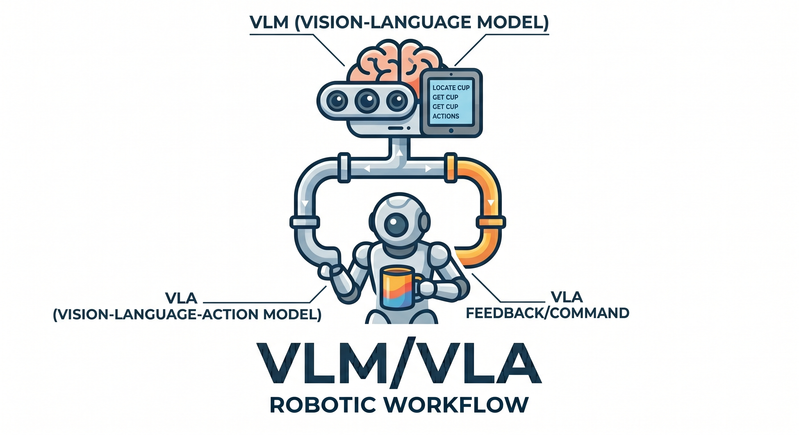

# 🤖 Robotic Task Orchestrator

A multimodal ROS 2 agent that captures environmental state via camera and orchestrates complex robotic subtasks using Vision-Language Models (VLMs).

<div align="center">
  
</div>

## 🧰 Tech Stack

[](https://docs.ros.org/en/humble/index.html)
[](https://www.python.org/)
[](https://www.langchain.com/)
[](https://ollama.com/)
[](https://docs.astral.sh/uv/)
[](#)

## 🚀 Features

- **Multimodal Intelligence**: Uses `qwen3-vl` to analyze real-time environment state.
- **ROS 2 Integration**: Built-in image subscriber for direct communication with robotic sensors.
- **LangGraph Workflow**: State-of-the-art orchestration using directed graphs for robust execution.
- **Memory Support**: Short-term memory ability using `InMemorySaver` to track conversation context.
- **Premium Console UI**: Stylized interface powered by `rich` with processing status and execution time tracking.

## 🛠️ Installation

### 1. Clone the Repository
```bash
git clone https://github.com/romerhomerobotics/Agent.git
cd Agent
```

### 2. Install Prerequisites

#### Install `uv`
```bash
curl -LsSf https://astral.sh/uv/install.sh | sh
# OR
wget -qO- https://astral.sh/uv/install.sh | sh
```

#### Install `Ollama` and Model
```bash
# Install Ollama
curl -fsSL https://ollama.com/install.sh | sh

# Pull and run the vision model (run once to download)
ollama run qwen3-vl:8b
```

### 3. Setup Python Environment (using `uv`)
```bash
# Initialize uv project (if not already)
uv init --python 3.10

# Create and activate virtual environment
uv venv agent
source agent/bin/activate

# Install dependencies
uv pip install -r requirements.txt 
```

### 4. Setup ROS 2 Environment
Ensure your ROS 2 Humble environment is sourced inside the uv environment:
```bash
source /opt/ros/humble/setup.bash 
```

## 🎮 Usage

Run the orchestrator from the root directory:
```bash
python3 src/agent.py
```

### 💡 Quick Start
Once running, simply type your high-level task (e.g., "arrange the table" or "is the task completed?"). The agent will:
1. Capture a frame from the ROS 2 topic (`/front/color/image_raw`).
2. Analyze the scene using `qwen3-vl` model.
3. Provide a detailed orchestration plan or a direct answer.

## 📂 Project Structure
- **`src/agent.py`**: Main entry point and graph construction.
- **`src/nodes.py`**: Graph node definitions and multimodal prompt logic.
- **`src/tools.py`**: ROS 2 image subscriber and processing tools.
- **`src/ui.py`**: Rich UI components and console formatting.
